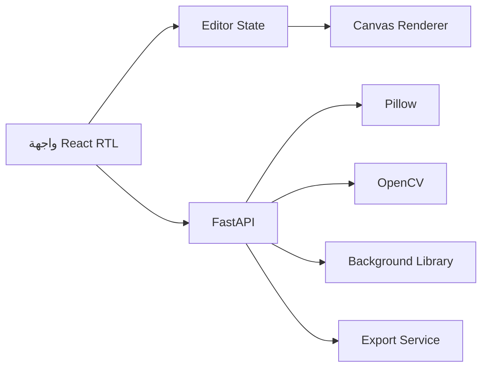

# معمارية ProductStudio

## المكونات



## هيكل الطبقات

| الطبقة | المسؤولية |
|---|---|
| UI | الأدوات، النوافذ، RTL، الرسائل |
| Editor State | الطبقات، التاريخ، التحديد، إعدادات التصدير |
| Canvas | العرض والرسم والتحريك |
| API | رفع الملفات، العمليات الثقيلة، التصدير |
| Image Engine | Pillow وOpenCV |
| Tests | اختبار الوحدات والواجهات والسيناريو النهائي |

## مسارات API

| Method | Path | Purpose |
|---|---|---|
| POST | `/api/images/upload` | استقبال صورة والتحقق منها |
| POST | `/api/images/transform` | قص وحجم ودوران وقلب |
| POST | `/api/images/adjust` | تعديلات الإضاءة والألوان |
| POST | `/api/images/filter` | الفلاتر وعمليات البكسل |
| POST | `/api/images/remove-background` | إنشاء قناع أولي |
| POST | `/api/images/export` | تجهيز الملف النهائي |
| GET | `/api/assets/backgrounds` | عرض الخلفيات |

## نموذج الطبقة

```json
{
  "id": "layer-1",
  "type": "image",
  "visible": true,
  "locked": false,
  "opacity": 1,
  "x": 0,
  "y": 0,
  "scale": 1,
  "rotation": 0
}
```
